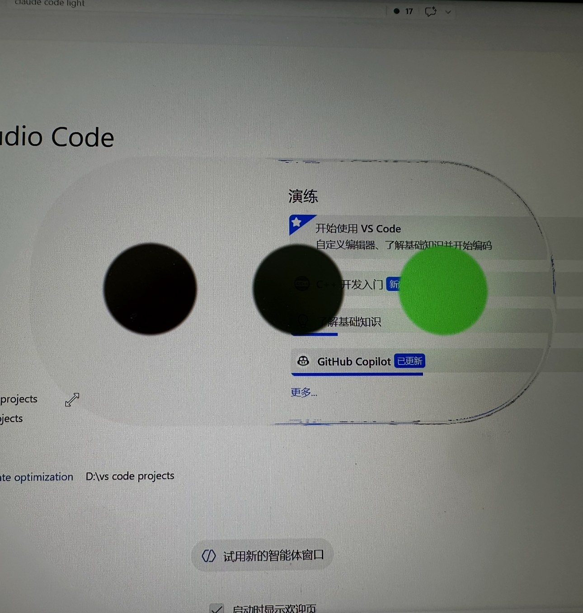

<div align="center">

# 🚦 Claude Code Light

**懸浮在桌面的液態玻璃紅綠燈 —— 上班 vibe coding 時，餘光一掃就知道 AI 在幹嘛。**


[](https://github.com/kiryusento2017/vibe-glass-light/releases)

[简体中文](../../README.md) · [English](README.en.md) · [日本語](README.ja.md) · [한국어](README.ko.md) · **繁體中文**



<sub>一塊真實折射桌面的液態玻璃膠囊，中間三盞燈即時跟著 Claude Code 的狀態走。</sub>

</div>

---

## 這是什麼

**Claude Code Light** 是一個 Windows 桌面小工具：一塊**永遠懸浮在最上層**的液態玻璃膠囊，透過它能看到真實桌面被即時折射扭曲。膠囊中間嵌著三盞紅綠燈，**即時反映 [Claude Code](https://claude.ai/code) 的工作狀態**——

> 紅燈閃 = 正在執行工具；黃燈閃 = 正在思考；綠燈恆亮 = 閒置等你；全滅 = 沒在跑。

寫程式時不用一直盯著終端機，**餘光掃一眼小工具就知道 AI 是在忙、在想、還是停了**。單一原生 `.exe`，不依賴任何執行階段，丟進隨身碟即插即用。

## ✨ 設計思路

靈感來自 **Apple 的「液態玻璃 (Liquid Glass)」**。和那些只會糊一層模糊背景的做法不同，它是**真・折射**：

- **即時折射真實桌面** —— 自行抓取螢幕像素 + 自寫 HLSL 折射 shader，玻璃後面的視窗、程式碼、桌布會像隔著真玻璃一樣被向心扭曲（中心清晰、邊緣強折射），而不是一張死圖或一塊模糊毛玻璃。
- **可拖曳** —— 按住膠囊隨手拖到螢幕任意角落，放手記憶位置。
- **按壓會 QQ 彈彈形變** —— 這是靈魂所在 🍮。按下去玻璃會像果凍一樣**橫向壓扁、縱向拉長**；拖得越快被「甩」得越窄；放手後靠**二階彈簧物理**Q 彈回彈、輕微過衝再歸位。整套形變參數（剛性／阻尼／過衝）都能在 `glass-tuning.json` 裡熱調，存檔即生效。
- **無段縮放** —— 按右鍵「調整大小」100%~2000% 任意放大縮小，大小位置自動記憶。

## 🚦 狀態對照表

| 燈 | 含義 | 觸發的 Claude Code 事件 |
|---|---|---|
| 🔴 **紅燈閃爍** | 正在執行工具 | `PreToolUse` |
| 🟡 **黃燈閃爍** | 正在思考 | `UserPromptSubmit` / `PostToolUse` |
| 🟢 **綠燈恆亮** | 閒置等待 | `Stop` |
| ⚫ **三燈全滅** | 未執行 | `claude.exe` 處理程序不存在 |

多狀態優先順序：**紅 > 黃 > 綠 > 灰**。多個 Claude 工作階段並行時，任一在忙就顯示忙，不會因為一個結束就誤判閒置。

## 💻 系統需求

| 需求 | 說明 |
|---|---|
| **作業系統** | **僅 Windows 10 (2004+) / 11**。**不支援 macOS / Linux**——核心依賴 Windows 獨有的 DirectComposition + Desktop Duplication，無跨平台計畫。 |
| **Claude Code** | 需本機已安裝 [Claude Code](https://claude.ai/code) CLI。這是**專為 Claude Code 設計**的狀態指示器，不支援 Cursor / Copilot / 其他 AI 工具。沒裝也能執行，但三燈恆灰。 |
| **執行階段** | **無**。單一原生 `.exe`，不依賴 Node / .NET / Electron / 任何框架。 |

## 📦 安裝（3 步）

**1️⃣ 下載**

從 [Releases](https://github.com/kiryusento2017/vibe-glass-light/releases) 下載 `claude-traffic-light.exe`，放到任意資料夾。

**2️⃣ 首次以系統管理員身分執行**

> 對 exe 按右鍵 →「以系統管理員身分執行」。**僅首次需要**，之後正常按兩下即可。

小工具首次啟動會在 exe 同資料夾釋出兩個設定檔：`config.json`（位置／縮放）和 `glass-tuning.json`（視覺／形變參數）。

**3️⃣ 給釋出的兩個檔案足夠的讀寫權限**

如果小工具裝在 **C 槽**（尤其 `C:\Program Files\` 這類受保護資料夾），系統可能不允許它寫設定檔。這時需手動給這兩個檔案**讀取 + 寫入**權限：對檔案按右鍵 →「內容」→「安全性」→「編輯」，勾選「寫入」。

> 💡 **一般只有裝在 C 槽才需要這一步。** 裝在 D 槽等其他磁碟時，小工具通常能直接釋出設定檔、不需要系統管理員權限，可略過此步。


裝好後，打開 Claude Code 開始 vibe coding，燈就會跟著動了。

## 🔒 它會動你電腦裡的哪些檔案？

跑一個陌生的 `.exe`，你最該關心的就是「它到底往我電腦裡寫了什麼」。這裡把它碰到的**每一個檔案、靠什麼運作**全攤開講清楚——它**不修改任何系統檔案，也完全不連網**。

### 靠什麼運作：Claude Code 的「掛勾 (Hooks)」

Claude Code 內建一套「掛勾」機制：在它**開始執行工具、思考、停下**等關鍵時刻，會自動執行你預先登記好的指令。本小工具就借這個機制運作——首次啟動時，往 Claude Code 自己的設定檔 `~/.claude/settings.json` 裡**加 4 條掛勾**，讓 Claude Code 狀態一變就順手「通知」小工具一聲，小工具據此切換燈色。這 4 條掛勾呼叫的指令**就是小工具自己**（`claude-traffic-light.exe hook <狀態>`），不依賴任何第三方程式（不像有的做法還要裝 Node）。

合併掛勾時我們很克制：

- **改之前先把整個 `settings.json` 備份**成 `settings.json.bak`；
- **只加自己這 4 條，絕不刪改你已有的任何設定**；
- 已經加過就不重複加（冪等）；
- **如果你沒裝 Claude Code（`~/.claude/` 資料夾不存在），它什麼都不寫、連資料夾都不會建。**

### 它會建立／寫入的全部檔案

| 檔案 | 在哪 | 幹嘛用的 | 何時寫 |
|---|---|---|---|
| `config.json` | **exe 同資料夾** | 記住小工具的位置／大小／各項開關 | 拖曳、縮放、按選單時 |
| `glass-tuning.json` | **exe 同資料夾** | 玻璃外觀與形變參數，供你手動調 | 首次啟動產生一次 |
| `settings.json`（**加 4 條掛勾**） | `~/.claude/` | 讓 Claude Code 狀態變化時通知小工具 | 首次啟動；改前先備份 |
| `settings.json.bak` | `~/.claude/` | 上面那份**改動前的完整備份** | 僅當掛勾有變動時 |
| `agent-light-state-<工作階段id>` | `~/.claude/agent-light/` | 每個 Claude 工作階段的目前狀態（**就一個詞**：`running`/`thinking`/`idle`） | 每次狀態變化覆寫 |
| 登錄檔 `Run` 項目 | `HKCU\...\Run`（使用者層級，**不跳 UAC**） | 實現「開機自動啟動」 | **僅當你勾選**開機自啟；取消即刪 |

> 前兩個（`config.json` / `glass-tuning.json`）就在 exe 旁邊、一眼可見、隨時可刪；後面幾個都在你自己的 `~/.claude/` 使用者資料夾下。**全程不碰 C 槽系統資料夾、不碰登錄檔敏感區。**

### 多個 Claude 一起跑也不會亂

每開一個 Claude 工作階段，小工具就給它**單獨建一個小狀態檔**（內容只有一個詞）。同時跑多個時，小工具每 0.1 秒把這些檔案彙總一次：**只要有任一個工作階段在忙，燈就顯示忙；全都閒置了才變綠。** 這樣一個 agent 先結束、另一個還在跑時，燈**不會被誤拉成綠**。這些小檔案超過 10 分鐘沒更新會被自動清理，不會越堆越多。

### 想徹底清除？

刪掉 exe 同資料夾的兩個 `.json` + `~/.claude/agent-light/` 資料夾，再把 `~/.claude/settings.json` 裡那 4 條掛勾刪掉（或直接用 `.bak` 還原）即可；關掉「開機自動啟動」會自動刪除那條登錄檔記錄。**解除安裝乾乾淨淨、不留尾巴。**

## 🎮 使用

- **拖曳** —— 按住可見膠囊拖曳移位（點膠囊外的透明區無反應，不會誤拖）。
- **右鍵選單 / 系統匣選單**：
  | 選單項目 | 作用 |
  |---|---|
  | 顯示 / 隱藏 | 切換可見，隱藏後可從系統匣圖示復原 |
  | 固定位置 | 鎖定後不可拖曳，防誤觸移位 |
  | 開機自動啟動 | 寫入登錄檔 Run 項目（使用者空間，不跳 UAC），取消即刪 |
  | 調整大小… | 跳出滑桿視窗，100%~2000% 無段縮放 |
  | 重設大小和位置 | 回 100%、螢幕頂部置中 |
  | 重新啟動 | 卡頓／異常時一鍵重啟（新執行個體接管，絕不「關了沒開」） |
  | 結束 | — |
- **系統匣** —— 對系統匣圖示按右鍵 = 同款選單；連按兩下圖示 = 顯示 / 隱藏。
- **調參** —— 編輯 exe 同資料夾的 `glass-tuning.json`，**存檔即熱重載（~0.5s 生效）**，無需重啟。

---

<details>
<summary><b>🔧 調參：全部參數與預設值</b>（點擊展開）</summary>

編輯 exe 同資料夾的 `glass-tuning.json`，**存檔即熱重載，無需重啟或重新編譯**。該檔案每台機器各一份、不進版本庫；刪掉它下次啟動會用下表預設值重新產生。預設值的權威來源是 `config/tuning.go` 的 `DefaultTuning()`。

**視覺參數**

| 參數 | 作用 | 預設 | 建議範圍 |
|---|---|---|---|
| `cornerR` | 圓角半徑(px)，越大越圓 | 48 | 0~115 |
| `cornerN` | 角部曲率指數，2=標準圓，越大越方（蘋果味 G2） | 2.1 | 2.0~4.0 |
| `refractBand` | 折射帶深度(px)，僅距邊緣這麼深處折射 | 3 | 1~30 |
| `edgeSqueeze` | 邊緣收縮，0=折射最強，1=不折射 | 0.25 | 0~1 |
| `contrast` | 對比度 | 1.2 | 0.5~2.0 |
| `brightness` | 亮度 | 0.9 | 0.5~2.0 |
| `saturate` | 飽和度 | 1.5 | 0~3 |
| `lampR` | 燈半徑(px) | 19 | 6~30 |
| `lampGap` | 燈間距(px)，紅↔黃↔綠中心距 | 64 | 38~90 |
| `glow` | 點亮外發光強度 | 0 | 0~1 |

**物理形變參數**

| 參數 | 作用 | 預設 | 建議範圍 |
|---|---|---|---|
| `springK` | 彈簧剛性，越大回彈越快越硬 | 120 | 30~300 |
| `springC` | 阻尼，越小過衝/彈動越明顯 | 8 | 1~20 |
| `steadyX` | 穩態水平縮放，<1 靜止偏窄 | 0.91 | 0.8~1.04 |
| `steadyY` | 穩態垂直縮放，>1 靜止偏長 | 1.11 | 0.9~1.30 |
| `pressX` | 按下水平縮放，<1 變窄 | 0.82 | 0.5~1.04 |
| `pressY` | 按下垂直縮放，>1 變高 | 1.22 | 0.8~1.30 |
| `dragK` | 拖曳形變力度，越大形變越猛 | 0.02 | 0.001~0.05 |
| `dragMin` | 拖曳形變下限，0.5=最多縮到 50% | 0.5 | 0.3~1.0 |
| `releaseImpulse` | 放手過衝倍率，>1 強化回彈 | 1.5 | 1.0~3.0 |

> ⚠️ **形變有硬上限**：畫布 240×144、玻璃 230×96，所以任意時刻水平縮放 ≤ 1.04、垂直縮放 ≤ 1.50，超了膠囊頂/底會被畫布切平。縱向拖曳已內建 `maxDragScaleY=1.4` 鉗制防撞牆。要更誇張的拉伸得改 `ui/glass.hlsl` 的 `CANVAS`/`PILL`（需重新編譯）。

</details>

<details>
<summary><b>🏗️ 架構與技術原理</b>（點擊展開）</summary>

### 算繪管線（方案核心）

```
Desktop Duplication 抓整個螢幕桌面紋理（GPU 常駐）
  → HLSL 超橢圓 SDF + 折射核（中心清晰、邊緣強折射）
  → DXGI 合成 swapchain → DirectComposition 透明置頂視窗
視窗設 WDA_EXCLUDEFROMCAPTURE 把自己從擷取中排除，切斷「自己折射自己」回饋
```

為什麼不用 CSS `backdrop-filter` / WebView2？因為它只能取樣 WebView 文件內部，**取不到作業系統桌面** → 舊版只能顯示成黑框。Windows 也沒有「對視窗背景做折射位移」的系統 API（DWM Acrylic 只有模糊無折射）。唯一出路就是自行抓取桌面像素 + 自寫折射 shader。

### 模組分層

```
main.go             進入點：單一執行個體互斥 → 載入設定 → 開機自啟同步 → 安裝掛勾 → 建視窗 + 監看
hookinstall.go      把狀態掛勾冪等合併進 ~/.claude/settings.json（先備份、只增不刪）
config/             config.json（位置/縮放/自啟）+ glass-tuning.json（視覺熱重載）
  autostart.go      登錄檔 HKCU Run 讀寫刪 + 路徑自我校正
state/              四態列舉（灰/綠/黃/紅）及優先順序聚合
watcher/            每 100ms 聚合各工作階段狀態檔（任一忙=忙）+ 每 3s 處理程序偵測後備滅燈
ui/
  window.go           DComp 透明置頂視窗、訊息迴圈、自接管滑鼠拖曳、彈簧形變狀態機
  render.go           D3D11 算繪管線：device/swapchain/shader 編譯 + 每幀繪製
  glass.hlsl          像素 shader：超橢圓 SDF 限定形狀 + 折射核 + 三燈疊加
  capture.go          Desktop Duplication 抓桌面紋理（隨縮放 Resize + 失效後限速重建）
  com.go              D3D11/DXGI/DComp COM 繫結
  win32.go            Win32 API 繫結與常數
  physics.go          二階彈簧物理（每幀 Euler 積分驅動形變）
  sizedialog.go       調整大小滑桿視窗（comctl32 trackbar）
```

### 狀態偵測：Claude Code Hooks（即時驅動）

不輪詢 transcript，而是靠 Claude Code 的 4 個生命週期掛勾**即時推送**狀態。小工具首次啟動時把這 4 條掛勾冪等合併進 `~/.claude/settings.json`，事件與狀態對應如下：

| Claude Code 事件 | 寫入狀態詞 | 燈 |
|---|---|---|
| `UserPromptSubmit` / `PostToolUse` | `thinking` | 🟡 思考中 |
| `PreToolUse` | `running` | 🔴 執行中 |
| `Stop` | `idle` | 🟢 閒置 |

每條掛勾以 exec form 直接呼叫小工具自己 `claude-traffic-light.exe hook <狀態詞>`（直接 spawn 不經 shell，規避 Windows 下 shell 不確定性），它只做一件事：把狀態詞寫進一個**每工作階段獨立的狀態檔**。

#### 每工作階段一個狀態檔 `agent-light-state-<session_id>`

Claude Code 觸發掛勾時會透過 **stdin 傳一段 JSON**，裡面帶著目前工作階段的 `session_id`。小工具從中讀出它，寫到：

```
~/.claude/agent-light/agent-light-state-<session_id>
```

檔案內容就是一個狀態詞（`running` / `thinking` / `idle`）。幾個要點：

- **每個工作階段一個檔、互不覆寫**——這是支援多 agent 的基礎（見下）。
- session_id 會被過濾成安全檔名（只保留字母/數字/連字號）；讀不到時回退為 `default`。
- 讀 stdin 帶 **500ms 硬逾時**，保證掛勾永遠毫秒級回傳、**絕不拖慢 Claude Code**。
- 統一塞進 `agent-light/` 子資料夾，不在 `~/.claude/` 根目錄攤一堆檔案。

#### 多 agent 並行：任一工作階段忙 → 全域忙

你完全可能**同時跑多個 Claude**（多個終端機視窗，或主工作階段派生出子 agent），它們各寫各的狀態檔。小工具的 watcher 每 100ms 把 `agent-light/` 資料夾下所有 `agent-light-state-*` 檔讀一遍，按優先順序 **紅 > 黃 > 綠 > 灰** 聚合成一個全域狀態：

```
工作階段 A: running  🔴 ┐
工作階段 B: idle     🟢 ├─ 取最高優先順序 ─→ 🔴 紅（A 還在幹活，就顯示忙）
工作階段 C: thinking 🟡 ┘
```

**只要有任一工作階段在忙，小工具就顯示忙。** 這樣當一個 agent 先結束（寫了 `idle`）、而另一個還在跑時，燈**不會被誤拉成綠**；只有全部工作階段都 `idle` 才顯示綠，一個檔都沒有才顯示灰。

#### 其餘後備機制

- **忙態只信掛勾內容**，不做時間窗逾時降級（長思考無工具呼叫→無掛勾，按逾時會被誤判閒置）。
- **處理程序偵測後備滅燈**：每 3s 用 `CreateToolhelp32Snapshot` 偵測 `claude.exe`，處理程序不在則強制灰——當機 / 強殺 / 開機殘留統一靠這條回灰。
- **定時清理**：每 30s 刪除超 10 分鐘沒更新的殘留工作階段檔（純磁碟回收，與狀態判定解耦）。
- **掛勾 handler 就是小工具自己**，零外部依賴（不像別的做法還要裝 node）。

</details>

<details>
<summary><b>🛠️ 從原始碼建置</b>（點擊展開）</summary>

需要 Go 工具鏈 + Windows：

```powershell
# 偵錯（帶主控台看輸出，不產生 exe）
go run .

# 編譯 exe（唯一一條指令，四件防護一次帶齊）
go build -trimpath -buildvcs=false -ldflags="-H windowsgui" -o dist/claude-traffic-light.exe .

# 測試
go test ./...
```

> **編譯鐵律**：偵錯用 `go run .`；產 exe 只用上面那條——`-trimpath`（清本機路徑/使用者名稱）、`-buildvcs=false`（清 git 資訊）、`-ldflags="-H windowsgui"`（無黑窗）、`-o dist/`（隔離），並自動嵌入 `rsrc_windows_amd64.syso`（圖示+版本資訊）。**嚴禁 `-s -w`**（觸發防毒軟體誤判）、**嚴禁加殼**。

**螢幕錄影示範**：正常 exe 對 OBS 等錄影軟體隱形（`WDA_EXCLUDEFROMCAPTURE` 設計使然）。帶 `--demo` 啟動可解除排除讓 OBS 錄到，但玻璃會折射到自己。想要最乾淨的示範畫面，用手機/相機拍螢幕即可。

</details>

## 🚧 限制 / 範圍外

- **僅 Windows**，不支援 macOS / Linux
- **僅 Claude Code**，不支援其他 AI 工具
- **點擊穿透**：DComp 透明置頂視窗無法穿透到下層，膠囊外透明區會擋住下層視窗點擊（已知限制）
- 無聲音提示、無多螢幕自動定位

## 📄 授權

[MIT](../../LICENSE)
